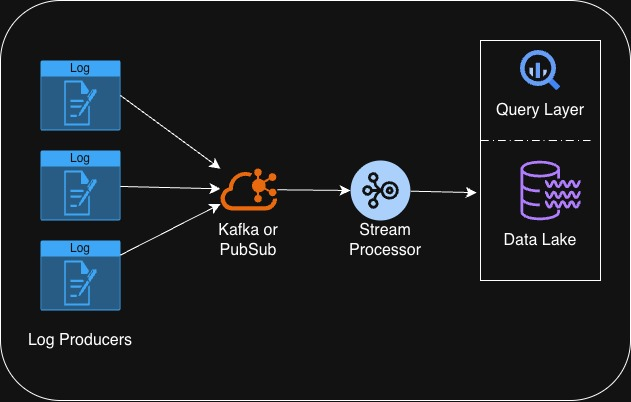

# Security Telemetry & Data Pipelines
## Goal
To understand the design and reasoning behind high-volume (scalable) security telemetry pipelines.  

Developing a mini version of a security data pipeline that ingests:
- Auth logs
- API access logs
- Network-like events

## Architecture

## Core Features
- Schema validation for events
- Normalization to a common event model (this is similar to ASIM model in Azure)
- Simple Enrichment (geographical/user metadata)
- Dead Letter Queue (DLQ) for malformed events